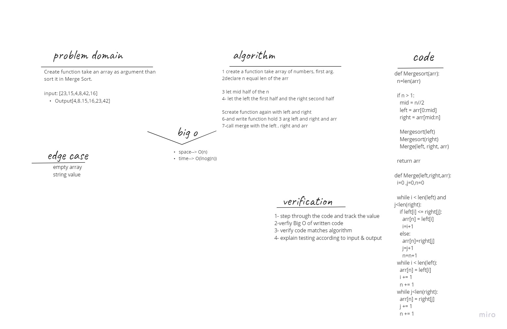

# Challenge Summary
Create function take an array as argument than sort it in Merge Sort.

## Whiteboard

# Approach & Efficiency
Ceate function take array of numbers as arg
declear n equal the length of array
let mid half of n
let left the first half and right the seconde half
clal the function again with left and right
after that create new function called merge take three argument left, right and the orgnal array
call merge with the left, right and array

# Big O :
Time--> O(nlog(n))
space--> O(n)

# Solution

input = [8,4,23,42,16,15]
Expected output = [4,8,15,16,23,42]

InsertionSort(arr):

  n=6
  if 6>1: True
     mid =3
     left = [4,8,15]
     right = [16,23,42]
     mergesort(left)
      mergesort(right)
      merge(left, rigth,arr)
....

return [4,8,15,16,23,42]
