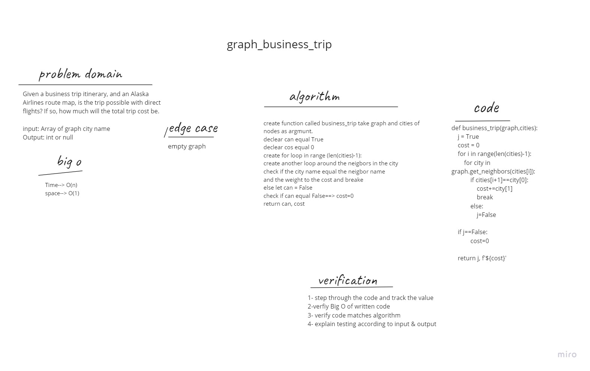

# Graph Business Trip
Given a business trip itinerary, and an Alaska Airlines route map, is the trip possible with direct flights? If so, how much will the total trip cost be.

## Challenge Summary
Write a function called business trip

Arguments: graph, array of city names
Return: int or null

## Whiteboard Process

## Approach & Efficiency

create function called business_trip take graph and cities of nodes as argmunt.
1. declear can equal True
2. declear cos equal 0
3. create for loop in range (len(cities)-1):
4. create another loop around the neigbors in the city
5. check if the city name equal the neigbor name and the weight to the cost and breake else let can = False
6. check if can equal False==> cost=0
7. return can, cost

## big O
Time--> O(n)
space--> O(1)
