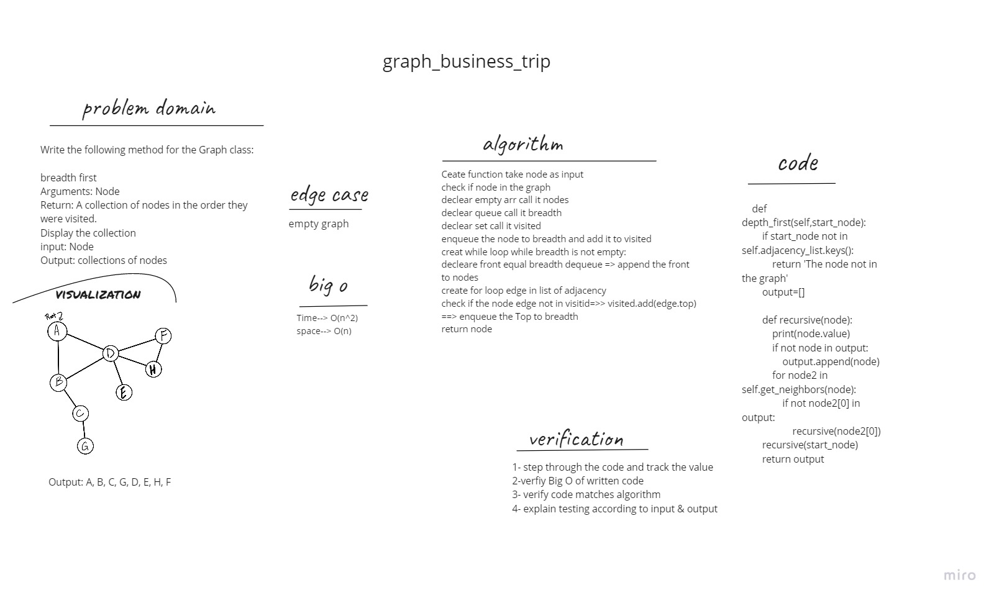

## Breadth-First Traversal of a Graph

## Challenge Summary

Write the following method for the Graph class:

breadth first
Arguments: Node
Return: A collection of nodes in the order they were visited.
Display the collection

## Whiteboard Process

## Approach & Efficiency

- Ceate function take node as input
- check if node in the graph
- declear empty arr call it nodes
- declear queue call it breadth
- declear set call it visited
- enqueue the node to breadth and add it to visited
- creat while loop while breadth is not empty:
- decleare front equal breadth dequeue => append the front to nodes
- create for loop edge in list of adjacency
- check if the node edge not in visitid=>> visited.add(edge.top) ==> enqueue the Top to breadth
- return node

## big O
Time--> O(n^2)
space--> O(n)
