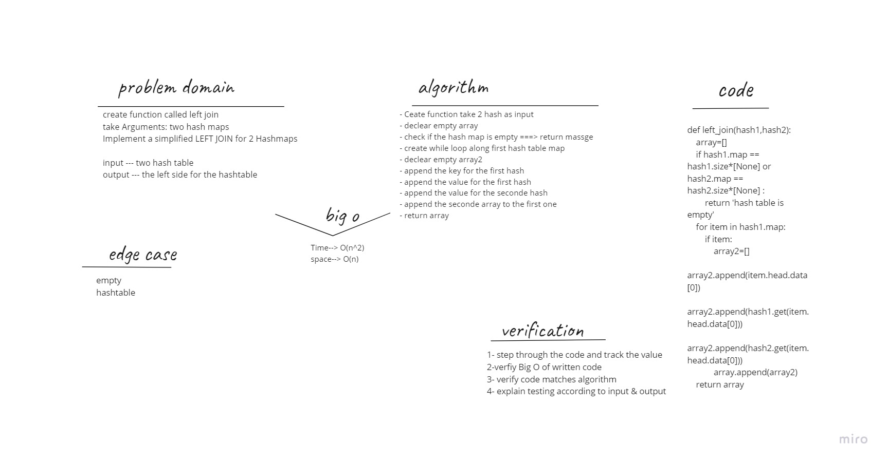

# Hashmap left join

# Challenge Summary

create function called left join
take Arguments: two hash maps
Implement a simplified LEFT JOIN for 2 Hashmaps

# Whiteboard Process

# Approach & Efficiency
- Ceate function take 2 hash as input
- declear empty array
- check if the hash map is empty ===> return massge
- create while loop along first hash table map
- declear empty array2
- append the key for the first hash
- append the value for the first hash
- append the value for the seconde hash
- append the seconde array to the first one
- return array

# big o
Time--> O(n^2)
space--> O(n)
