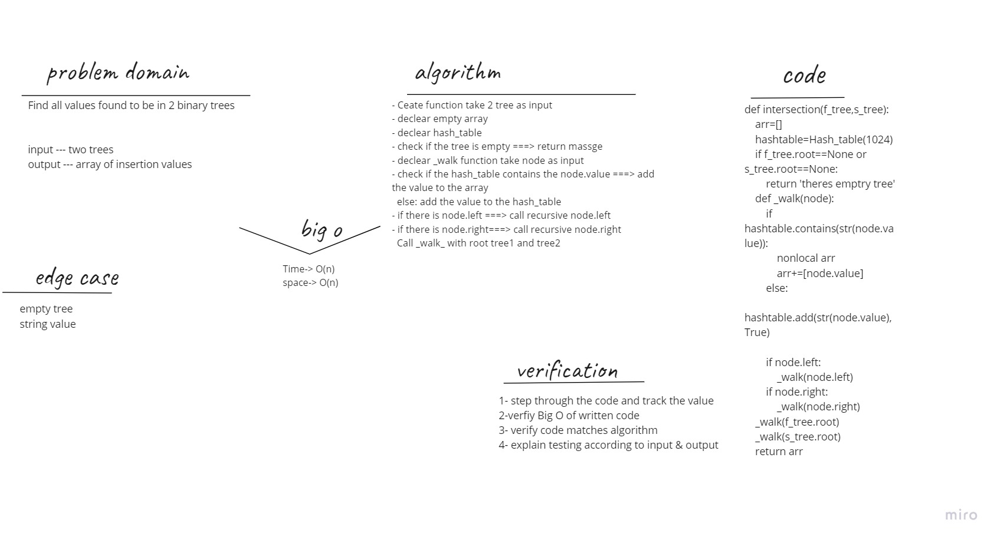

## Challenge Summary
Find all values found to be in 2 binary trees

## Whiteboard Process

## Approach & Efficiency
- Ceate function take 2 tree as input
- declear empty array
- declear hash_table
- check if the tree is empty ===> return massge
- declear _walk function take node as input
- check if the hash_table contains the node.value ===> add the value to the array
  else: add the value to the hash_table
- if there is node.left ===> call recursive node.left
- if there is node.right===> call recursive node.right
  Call _walk_ with root tree1 and tree2
return arr
## Big O :
Time-> O(n)
space-> O(n)

## Solution
-verification
input = tree1,tree2
Expected output =[100,160,125,175,200,350,500]

arr=[]
 hashtable=Hash_table(1024)
_walk(tree1.root):
1-hashtable.add(str(42),True)
2-hashtable.add(str(100),True)
....
11-hashtable.add(str(500),True)
_walk(tree2.root):
1-hashtable.add(str(150),True)
2-arr+=[100]
....
11-arr+=[500]
return [100,160,125,175,200,350,500]
