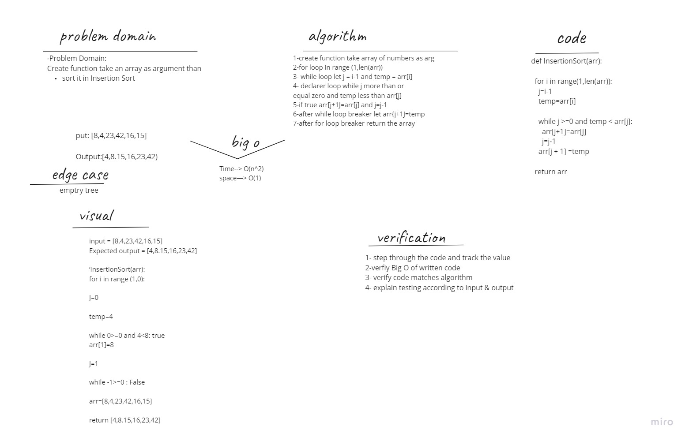

# Challenge Summary
Create function take an array as argument than sort it in Insertion Sort.

## Whiteboard Process

## Approach & Efficiency

Ceate function take array of numbers as arg
for loop in range (1,len(arr))
while loop let j = i-1 and temp = arr[i]
decleare another loop while j more than or equal zero and temp less than arr[j]
if true arr[j+1]=arr[j] and j=j-1
after while loop breake let arr[j+1]=temp
after for loop breake return the array

## Big O :
Time--> O(n^2)
space--> O(1)

## Solution
-verification
input = [8,4,23,42,16,15]
Expected output = [4,8,15,16,23,42]

InsertionSort(arr):
   for i in range (1,6):
       j=0
       temp=4
        while 0>=0 and 4<8: true
            arr[1]=8
             j=-1
         while -1>=0 : False

         arr=[4,8,23,42,16,15]
return [4,8,15,16,23,42]
