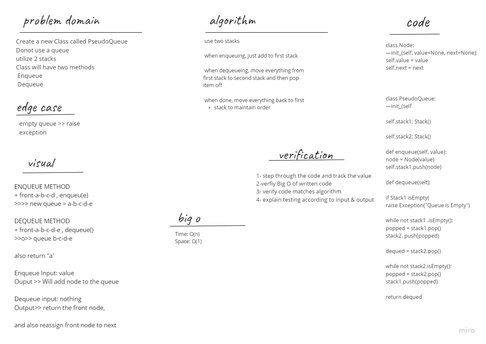

Challenge description
Create a new class called pseudo queue.

Do not use an existing Queue.

Instead, this PseudoQueue class will implement our standard queue interface (the two methods listed below),
Internally, utilize 2 Stack instances to create and manage the queue
Methods:
enqueue
    Arguments: value
        Inserts value into the PseudoQueue, using a first-in, first-out approach.
dequeue
    Arguments: none
        Extracts a value from the PseudoQueue, using a first-in, first-out approach.

Whiteboard

approach and efficiency
We used two stacks. All items get pushed and stored on the first stack. Whenever a dequeu needs to happen, we move everything from the first stack to the second and then pop off. Then to keep the correct order, we pop everything back into the first stack.

Big O:

Time: O(n) Space: O(1)
