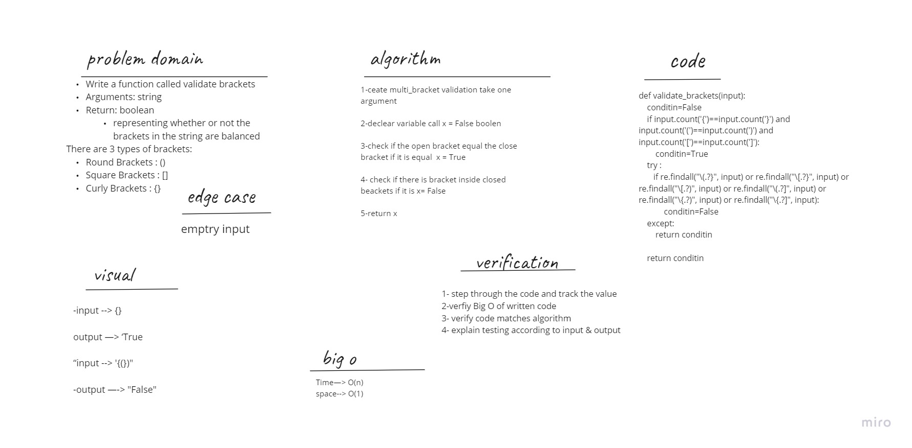

# Challenge Summary
function should take a string as only argument, and should return a boolean representing whether or not the brackets in the string are balanced.

# Approach & Efficiency
Create bracket_validate take one argument, declear varible call condition = False boolen, check if the open bracket equal the close bracket if it is condition = True, check if there is bracket inside closed beackets if it is condition= False, return condition.

Big O :

time : O(n)
space : O(1)

# Whiteboard

# solution
input ={}
Output = True
condition=False
if under the rule : True
    condition=True
if : False
return True
the error type
 input ={(})
expected Output = False
condition=False
under the rule
 if true input and the other true input : rue
    condition=True
if [} : True
     condition=False
return False
