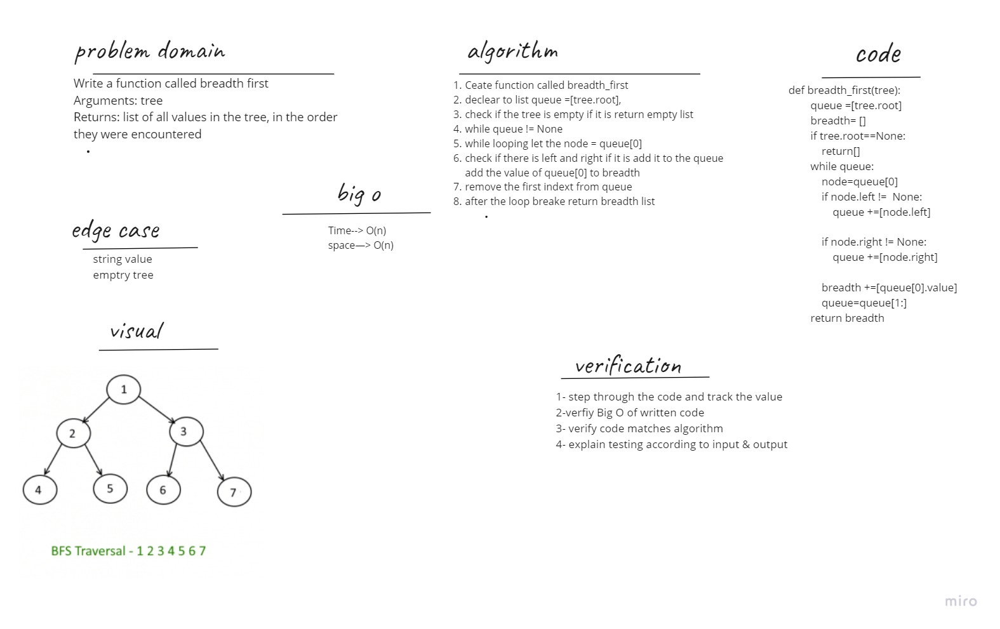

# Challenge Summary
Write a function called breadth first

Arguments: tree
Returns: list of all values in the tree, in the order they were encountered

## Whiteboard Process

## Approach & Efficiency

Big O :
Time--> O(n)
space--> O(n)
