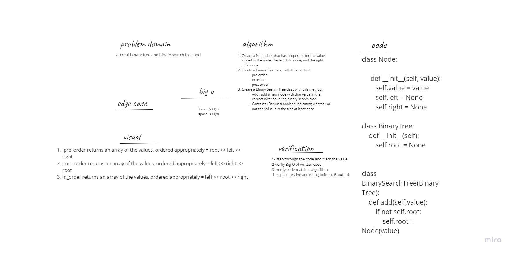
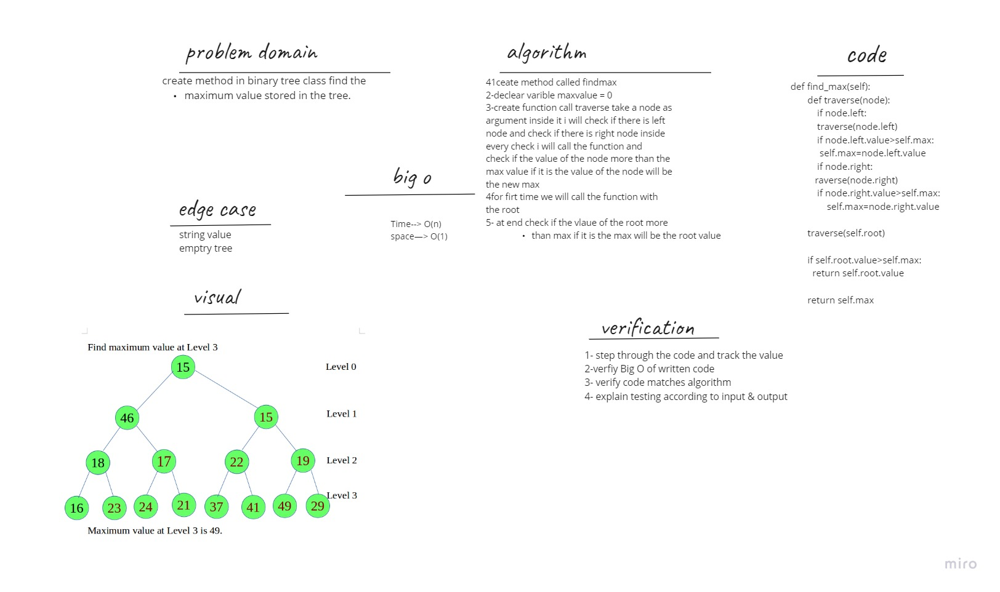

# BinaryTree
Create a Binary Tree and Binary Search Tree with their common methods

# Challenge Summary
dealing with recursive and add Node in the correct place to keep tree balanced

# Challenge Description
create Node class create Binary Tree create Binary Search Tree

# white-board

# find-maximum-value

# Challenge Summary
*create a method without utilizing any of the built-in methods available to your language, return the maximum value stored in the tree.*

## Challenge Description
Write method for the Binary Tree class find maximum value :

Arguments: none
Returns: number
Find the maximum value stored in the tree.
*create find-maximum-value method*

## Approach & Efficiency
Ceate method called find max, declear varible maxvalue = 0 Create function call traverse take a node as argument inside it i will check if there is left node and check if there is right node inside every check i will call the function again and check if the value of the node more than the max value if it is the value of the node will be the new max, for firt time we will call the function with the root, at end check if the vlaue
of the root more than max if it is the max will be the root value

# white-board

